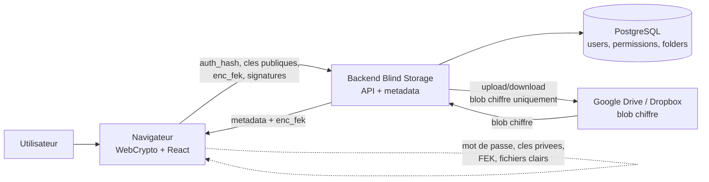
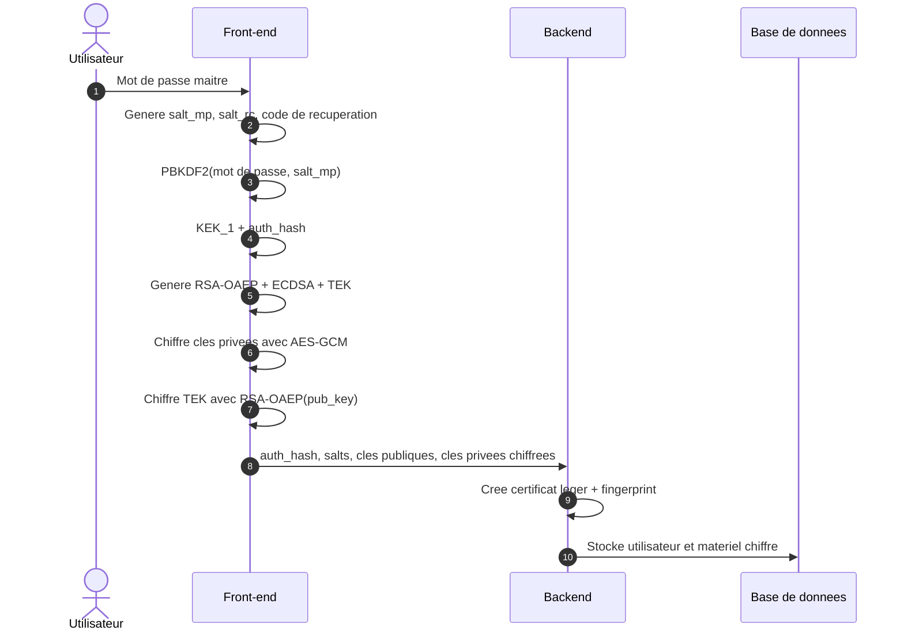
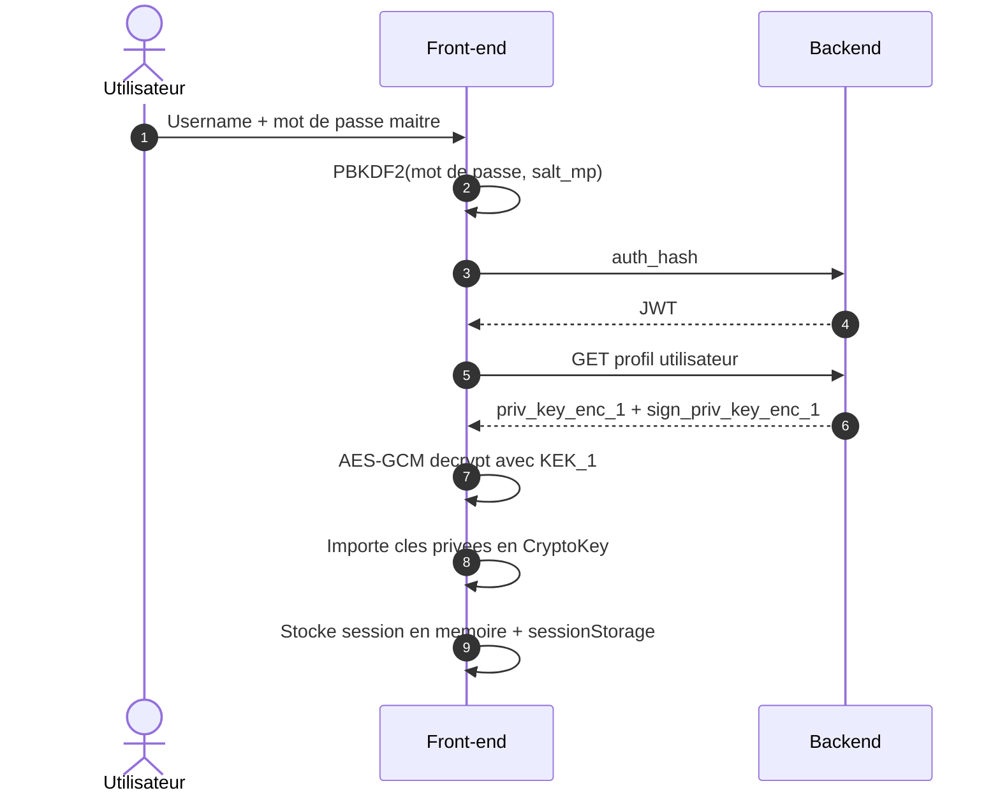
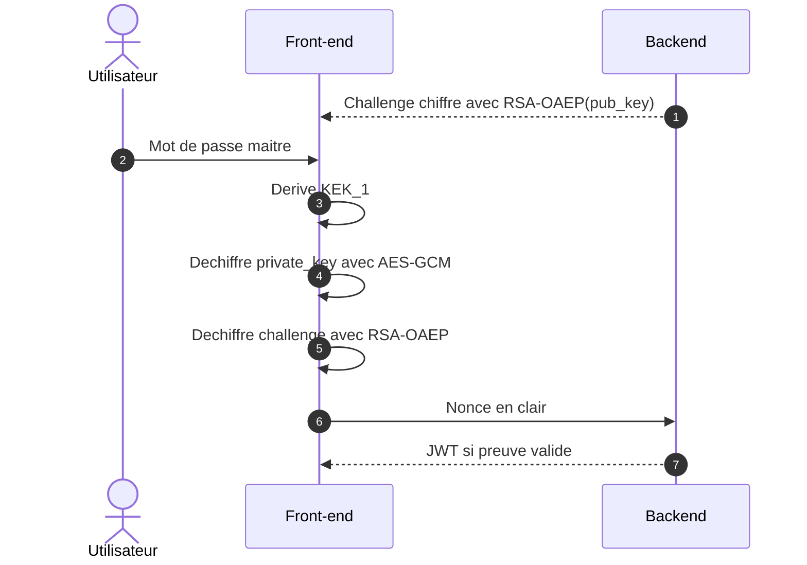
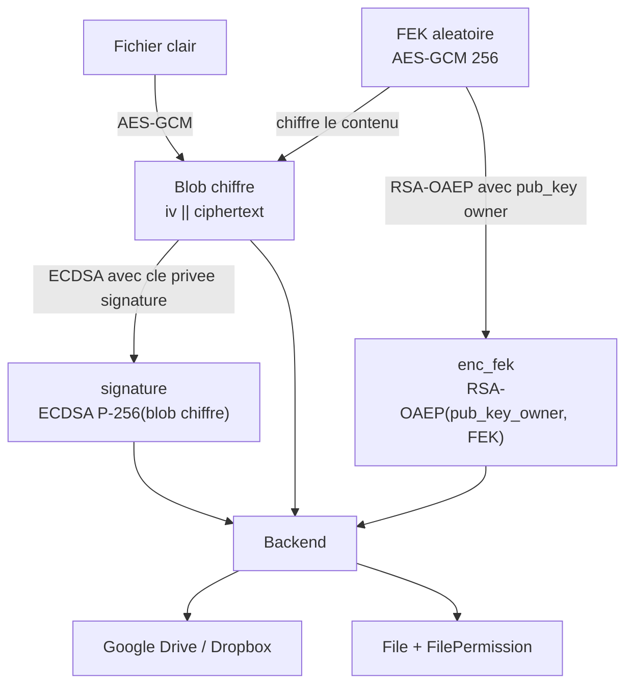
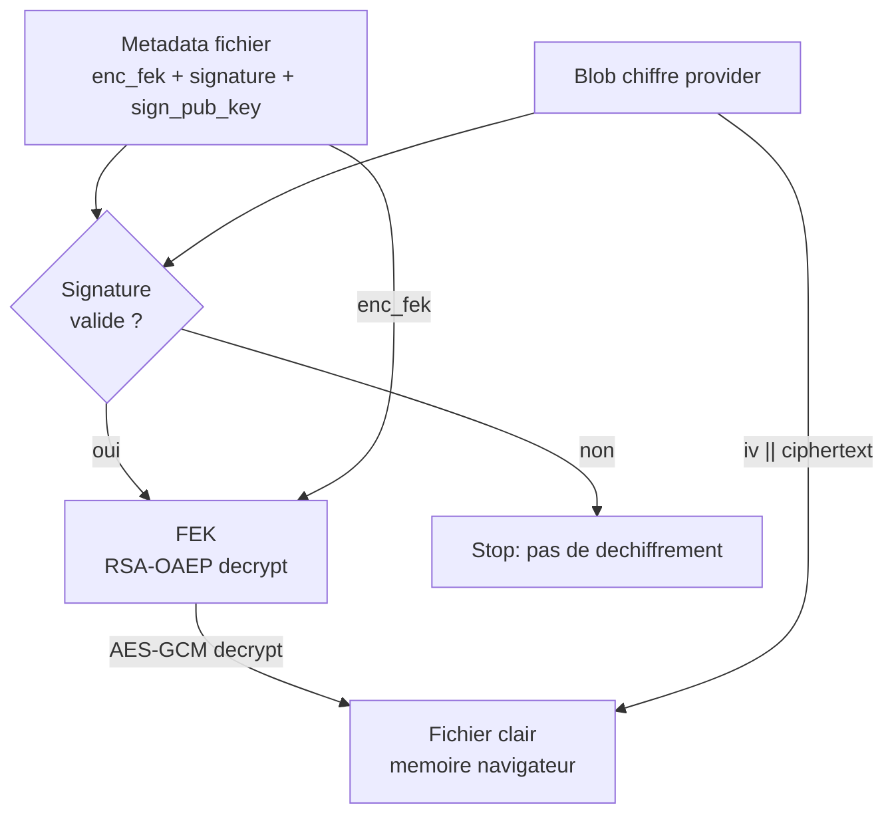
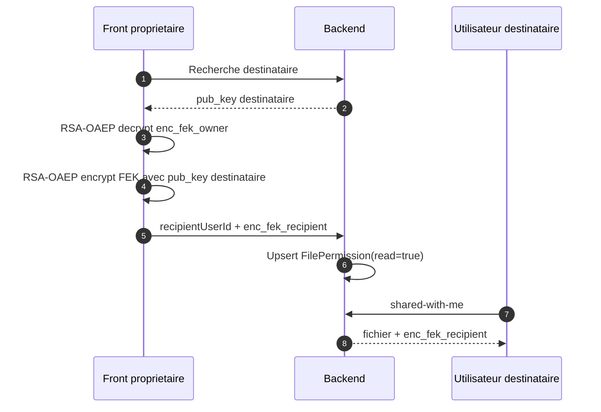
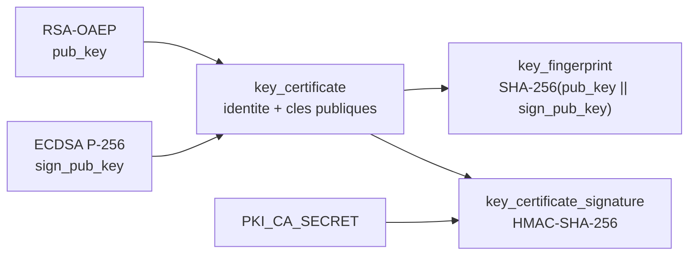

# Cryptographie cote front-end

Ce document decrit la cryptographie actuellement executee par le front-end Blind Storage.
Le point central est le suivant : le serveur ne doit jamais recevoir le mot de passe maitre,
les fichiers en clair, la cle privee en clair, ni une cle de fichier en clair.

Les primitives sont implementees dans `lib/crypto.ts`. Les flux applicatifs qui les utilisent
sont principalement dans `app/(auth)/*`, `context/auth.tsx` et `app/(app)/storage/page.tsx`.

## Vue d'ensemble

Principe general :

- le navigateur fait toute la cryptographie sensible ;
- le backend orchestre les droits, les metadata et les providers cloud ;
- les providers cloud ne stockent que des blobs deja chiffres.

## Primitives utilisees

| Usage | Algorithme | Parametres / format |
| --- | --- | --- |
| Derivation mot de passe maitre | PBKDF2 | SHA-256, 600 000 iterations, salt 32 octets |
| Derivation code de recuperation | PBKDF2 | SHA-256, 600 000 iterations, salt 32 octets |
| Chiffrement symetrique | AES-GCM | Cle 256 bits, IV aleatoire 12 octets |
| Cle publique / cle privee | RSA-OAEP | 2048 bits, exponent 65537, SHA-256 |
| Encodage stockage/API | Base64 | Donnees binaires converties en chaines |
| Format AES-GCM metadata | Texte | `base64(iv):base64(ciphertext)` |
| Format fichier chiffre | Binaire | `iv(12 octets) || ciphertext` |

## Donnees stockees cote navigateur

### `localStorage`

Le front stocke :

- le JWT (`blind_token`) ;
- les salts non secrets (`blind_salt_<username>`).

Les salts ne sont pas secrets. Ils servent a recalculer les derivations PBKDF2 lors des connexions suivantes.

Le front ne stocke pas le mot de passe maitre dans `localStorage`.

### `sessionStorage`

Le front stocke la cle privee dechiffree exportee en PKCS#8 base64 dans `sessionStorage`, sous `blind_pk`.

Ce choix est un compromis UX/securite :

- la cle survit aux rechargements et redirections OAuth dans le meme onglet ;
- elle est effacee a la fermeture de l'onglet ;
- elle n'est pas partagee entre onglets ;
- elle n'est pas persistante comme `localStorage`.

Au chargement de l'application, `context/auth.tsx` recharge le JWT depuis `localStorage`, recharge le profil utilisateur, puis tente de reimporter cette cle privee depuis `sessionStorage`.
Si l'import echoue, la cle privee est supprimee de `sessionStorage`.

### Memoire React

La session courante conserve aussi la cle privee sous forme `CryptoKey` dans le contexte React `AuthProvider`.
Cette cle est utilisee pour :

- dechiffrer les FEK des fichiers ;
- rechiffrer une FEK pour un destinataire lors d'un partage ;
- prouver la possession de la cle privee dans certains flux OIDC.

## Inscription locale

Fichier principal : `app/(auth)/register/page.tsx`.

1. L'utilisateur choisit un mot de passe maitre.
2. Le front genere :
   - `salt_mp` : 32 octets aleatoires ;
   - `salt_rc` : 32 octets aleatoires ;
   - un code de recuperation de 128 bits sous forme lisible ;
   - une paire RSA-OAEP 2048 bits ;
   - une TEK AES-GCM 256 bits.
3. Le mot de passe maitre + `salt_mp` passent dans PBKDF2-SHA-256, 600 000 iterations.
4. La derivation produit 512 bits :
   - les 32 premiers octets deviennent `KEK_1`, une cle AES-GCM ;
   - les 32 derniers octets deviennent `auth_hash`, envoye au serveur pour l'authentification.
5. Le code de recuperation + `salt_rc` passent dans PBKDF2-SHA-256, 600 000 iterations, pour produire `KEK_2`.
6. La cle privee RSA est exportee en PKCS#8 puis chiffree deux fois en AES-GCM :
   - `priv_key_enc_1 = AES-GCM(KEK_1, private_key_pkcs8)` ;
   - `priv_key_enc_2 = AES-GCM(KEK_2, private_key_pkcs8)`.
7. La TEK est exportee puis chiffree avec la cle publique RSA :
   - `tree_enc_key = RSA-OAEP(pub_key, raw_TEK)`.
8. Le front envoie au serveur :
   - `username`, `email`, `auth_hash` ;
   - `salt_mp`, `salt_rc` ;
   - `pub_key` ;
   - `priv_key_enc_1`, `priv_key_enc_2` ;
   - `tree_enc_key`.

Le serveur ne recoit ni le mot de passe maitre, ni la cle privee en clair, ni la TEK en clair.

## Connexion locale

Fichier principal : `app/(auth)/login/page.tsx`.

1. L'utilisateur saisit son username et son mot de passe maitre.
2. Le front recupere ou utilise le `salt_mp` associe.
3. Le front derive `KEK_1` et `auth_hash` avec PBKDF2-SHA-256, 600 000 iterations.
4. Le front envoie `auth_hash` au backend comme secret d'authentification.
5. Apres succes, le front recupere le profil complet incluant `priv_key_enc_1`.
6. Le front dechiffre la cle privee :
   - `private_key_pkcs8 = AES-GCM-DECRYPT(KEK_1, priv_key_enc_1)`.
7. La cle privee est importee en `CryptoKey` RSA-OAEP.
8. `AuthProvider.setSession` stocke :
   - le JWT en `localStorage` ;
   - la cle privee en memoire React ;
   - une copie PKCS#8 base64 de la cle privee en `sessionStorage`.

## Connexion OIDC

Il existe deux cas.

### OIDC avec compte deja configure

Fichier principal : `app/(auth)/oidc-unlock/page.tsx`.

1. Le backend renvoie un challenge chiffre avec la cle publique de l'utilisateur.
2. L'utilisateur saisit son mot de passe maitre.
3. Le front derive `KEK_1` avec PBKDF2.
4. Le front dechiffre `priv_key_enc_1` avec AES-GCM.
5. Le front dechiffre le challenge avec RSA-OAEP et renvoie le nonce en clair au backend.
6. Si le backend valide la preuve de possession, il renvoie un JWT.
7. La session front est finalisee comme en connexion locale.

Ce flux prouve que l'utilisateur possede la cle privee sans l'envoyer au serveur.

### Premier setup OIDC

Fichier principal : `app/(auth)/oidc-setup/page.tsx`.

Le flux crypto est equivalent a l'inscription locale :

- generation salts ;
- generation code de recuperation ;
- generation RSA-OAEP ;
- generation TEK ;
- chiffrement de la cle privee avec `KEK_1` et `KEK_2` ;
- chiffrement de la TEK avec la cle publique.

La difference est que l'identite initiale vient du provider OIDC.

## Changement de mot de passe maitre

Fichier principal : `app/(app)/account/page.tsx`.

1. L'utilisateur saisit l'ancien et le nouveau mot de passe.
2. Le front derive l'ancienne `KEK_1` avec l'ancien mot de passe et l'ancien `salt_mp`.
3. Si la cle privee n'est pas deja en memoire, le front dechiffre `priv_key_enc_1`.
4. Le front genere un nouveau `salt_mp`.
5. Le front derive une nouvelle `KEK_1` et un nouveau `auth_hash`.
6. Le front rechiffre la meme cle privee avec la nouvelle `KEK_1`.
7. Le serveur recoit :
   - le nouveau `auth_hash` ;
   - le nouveau `salt_mp` ;
   - le nouveau `priv_key_enc_1`.

La cle privee ne change pas. Seule son enveloppe chiffree par mot de passe change.
`priv_key_enc_2` ne change pas, car il depend du code de recuperation.

## Envoi de fichier

Fichier principal : `app/(app)/storage/page.tsx`.

1. L'utilisateur selectionne un fichier.
2. Le front lit les octets en clair avec `File.arrayBuffer()`.
3. Le front genere une FEK aleatoire :
   - AES-GCM 256 bits ;
   - une FEK par fichier.
4. Le contenu du fichier est chiffre localement :
   - IV aleatoire 12 octets ;
   - AES-GCM avec la FEK ;
   - sortie binaire `iv || ciphertext`.
5. La FEK est exportee en brut puis chiffree avec la cle publique de l'utilisateur :
   - `enc_fek = RSA-OAEP(pub_key_owner, raw_FEK)`.
6. Le front envoie au backend :
   - le blob deja chiffre ;
   - le nom de fichier ;
   - `enc_fek` ;
   - le provider cible (`google-drive` ou `dropbox`) ;
   - le dossier virtuel de destination si applicable.
7. Le backend stocke le blob chiffre chez le provider cloud.
8. Le backend cree en base un `File` et une `FilePermission` pour le proprietaire.

Le serveur et le provider cloud ne voient que des octets chiffres.

## Telechargement et dechiffrement de fichier

Fichier principal : `app/(app)/storage/page.tsx`.

1. Le front liste les fichiers via le backend.
2. Pour chaque fichier accessible, le backend renvoie l'`enc_fek` correspondant a l'utilisateur courant.
3. Au telechargement, le backend recupere le blob chiffre chez le provider.
4. Le front dechiffre la FEK :
   - `raw_FEK = RSA-OAEP-DECRYPT(private_key, enc_fek)`.
5. Le front importe `raw_FEK` comme cle AES-GCM non exportable.
6. Le front separe le blob :
   - les 12 premiers octets sont l'IV ;
   - le reste est le ciphertext.
7. Le front dechiffre avec AES-GCM et declenche le telechargement du fichier en clair dans le navigateur.

Le fichier en clair existe uniquement dans la memoire du navigateur au moment de l'action.

## Partage de fichier

Fichiers principaux :

- `app/(app)/storage/page.tsx`
- `lib/crypto.ts`
- `lib/drive.ts`

Le partage est actuellement en lecture seule.

1. Le proprietaire choisit un fichier et un destinataire par email ou username.
2. Le front recupere la cle publique du destinataire via le backend.
3. Le front prend l'`enc_fek` du proprietaire.
4. Le front dechiffre localement cette FEK avec la cle privee du proprietaire :
   - `raw_FEK = RSA-OAEP-DECRYPT(private_key_owner, enc_fek_owner)`.
5. Le front rechiffre immediatement cette meme FEK avec la cle publique du destinataire :
   - `enc_fek_recipient = RSA-OAEP(pub_key_recipient, raw_FEK)`.
6. Le front envoie au backend :
   - `fileId` ;
   - `recipientUserId` ;
   - `enc_fek_recipient` ;
   - droits `read: true`, `write: false`.
7. Le backend cree ou met a jour une entree `FilePermission`.

La FEK en clair n'est jamais envoyee au serveur.

Quand le destinataire ouvre "Fichiers partages avec moi", le backend lui renvoie les fichiers autorises avec son propre `enc_fek`.
Le destinataire decrypte ensuite exactement comme pour ses propres fichiers, avec sa cle privee.

## PKI legere et signatures

Les nouveaux comptes generent maintenant deux paires de cles cote client :

- `RSA-OAEP 2048 / SHA-256` pour le chiffrement des FEK ;
- `ECDSA P-256 / SHA-256` pour signer les fichiers chiffres.

La cle publique de signature est envoyee au backend sous `sign_pub_key`.
La cle privee de signature est exportee en PKCS#8 puis chiffree exactement comme la cle privee RSA :

- `sign_priv_key_enc_1 = AES-GCM(KEK_1, signing_private_key_pkcs8)` ;
- `sign_priv_key_enc_2 = AES-GCM(KEK_2, signing_private_key_pkcs8)`.

Le backend cree une attestation legere :

- `key_certificate` lie `userId`, `username`, `email`, `pub_key` et `sign_pub_key` ;
- `key_fingerprint = SHA-256(pub_key || sign_pub_key)` ;
- `key_certificate_signature = HMAC-SHA-256(PKI_CA_SECRET, canonical_certificate)`.

Cette PKI est volontairement "legere" : elle donne une identite applicative stable et auditable, mais ce n'est pas encore une PKI externe avec CA publique/verifiable hors serveur.

### Upload signe

Pendant l'upload :

1. le fichier clair est chiffre localement avec `AES-GCM` et une FEK aleatoire ;
2. le blob chiffre `iv || ciphertext` est signe avec `ECDSA P-256 / SHA-256` ;
3. le front envoie au backend le blob chiffre, `enc_fek` et `signature` ;
4. le backend stocke la signature dans les metadonnees `cloud_data`.

La signature porte sur le fichier chiffre, pas sur le clair. Le serveur peut donc stocker et relayer la preuve d'integrite sans voir le contenu.

### Download verifie

Pendant le download :

1. le front telecharge les octets chiffres ;
2. si une signature et une `sign_pub_key` sont presentes, il verifie `ECDSA P-256 / SHA-256` avant de dechiffrer ;
3. si la verification echoue, le fichier n'est pas dechiffre.

Les anciens fichiers sans signature restent telechargeables pour compatibilite, mais ils ne beneficient pas de cette verification.

## Connexion des providers cloud

Google Drive et Dropbox servent uniquement de stockage d'octets chiffres.

Le flux OAuth de connexion provider :

1. Le front demande une URL de connexion au backend.
2. Le backend genere un `state` signe lie a l'utilisateur et au provider.
3. L'utilisateur autorise Google Drive ou Dropbox.
4. Le callback revient au backend.
5. Le backend echange le code OAuth contre des tokens provider.
6. Les tokens provider sont stockes cote backend dans `OidcConnection`.

Ces tokens ne donnent pas acces au contenu en clair, car les fichiers sont chiffres avant l'upload.

Important : le front ne manipule pas directement les tokens Google Drive ou Dropbox.

## Arborescence et metadata

Le code actuel utilise une arborescence virtuelle cote backend (`Folder`, `File.folderId`) et un miroir provider pour Google Drive / Dropbox.

Crypto associee :

- les noms de fichiers et dossiers actuellement visibles dans l'application sont stockes comme metadata applicatives ;
- le contenu des fichiers reste chiffre cote client ;
- une TEK existe dans le modele crypto pour chiffrer une arborescence utilisateur, mais l'arborescence active de la page fichiers repose aujourd'hui sur les tables backend `Folder` et `File`.

Il faut donc distinguer :

- contenu fichier : chiffre de bout en bout actuellement ;
- metadata d'arborescence visible dans l'app : geree par le backend actuellement ;
- modele `UserTree` chiffre : present dans l'architecture, mais pas le coeur de la page fichiers actuelle.

## Ce qui n'est pas encore implemente

Certaines notions existent dans la documentation ou le schema, mais ne sont pas encore appliquees partout cote front :

- partage en ecriture ;
- revocation forte par rotation de FEK et rechiffrement du fichier ;
- chiffrement complet de l'arborescence active affichee dans "Mes fichiers".

Ces points doivent etre traites separement avant de les annoncer comme garanties applicatives.

## Resume securite par action

| Action | Secret en clair cote serveur ? | Crypto principale |
| --- | --- | --- |
| Inscription | Non | PBKDF2, AES-GCM, RSA-OAEP |
| Connexion locale | Non | PBKDF2, AES-GCM |
| OIDC unlock | Non | PBKDF2, AES-GCM, RSA-OAEP challenge |
| Upload fichier | Non | AES-GCM pour contenu, RSA-OAEP pour FEK, ECDSA pour signature |
| Download fichier | Non | Verification ECDSA, RSA-OAEP pour FEK, AES-GCM pour contenu |
| Partage fichier | Non | RSA-OAEP decrypt owner FEK, RSA-OAEP encrypt recipient FEK |
| Connexion cloud | Pas de contenu clair | OAuth provider, contenu deja chiffre |
